# Ntfy MQ 


[](https://opensource.org/licenses/MIT)
[](https://www.python.org/downloads/)
[](https://fastapi.tiangolo.com)
[](https://github.com/psf/black)
[](https://www.rabbitmq.com/)
[](https://docs.celeryq.dev/)
[](https://python-poetry.org/)
[](https://ntfy.sh/)
[](https://www.docker.com/)


Simple notification microservice that uses ntfy.sh to send notifications through RabbitMQ and Celery.

## Tech Stack

- **Python**: Core programming language
- **FastAPI**: High-performance web framework for building APIs
- **RabbitMQ**: Message broker for handling notification queue
- **Celery**: Distributed task queue for processing notifications
- **Poetry**: Dependency management and packaging
- **ntfy.sh**: Push notification service
- **Docker**: Containerization

## Architecture

```mermaid
graph LR
    %% Client Applications
    Client([fa:fa-laptop Client])
    style Client fill:#f9f9f9,stroke:#333,stroke-width:2px
    
    %% FastAPI Service
    subgraph API_Gateway["API Gateway Layer"]
        API[fa:fa-bolt FastAPI Service<br/>POST /notifications]
        VAL{fa:fa-check-circle Input Validation}
        AUTH{fa:fa-key Authentication}
        API --> VAL
        VAL --> AUTH
    end
    style API_Gateway fill:#e1f5fe,stroke:#01579b,stroke-width:2px
    
    %% Message Queue
    subgraph Message_Queue["Message Queue Layer"]
        RMQ[(fa:fa-server RabbitMQ<br/>notification.queue)]
        QOS[fa:fa-tachometer Quality of Service<br/>prefetch_count=1]
        RTY[fa:fa-refresh Auto Retry<br/>max_retries=3]
        RMQ --> QOS
        QOS --> RTY
    end
    style Message_Queue fill:#f3e5f5,stroke:#4a148c,stroke-width:2px
    
    %% Workers
    subgraph Workers["Worker Pool"]
        W1[fa:fa-cogs Celery Worker 1<br/>notification_handler]
        W2[fa:fa-cogs Celery Worker 2<br/>notification_handler]
        W3[fa:fa-cogs Celery Worker 3<br/>notification_handler]
        W4[fa:fa-cogs Celery Worker 4<br/>notification_handler]
    end
    style Workers fill:#e8f5e9,stroke:#1b5e20,stroke-width:2px
    
    %% Notification Service
    subgraph Notification["Notification Service"]
        N[fa:fa-bell ntfy.sh Service<br/>topic: your_topic]
        NR{fa:fa-dashboard Rate Limiting}
        NQ[fa:fa-list Queue Management]
        N --> NR
        NR --> NQ
    end
    style Notification fill:#fff3e0,stroke:#e65100,stroke-width:2px
    
    %% End Devices
    subgraph Devices["End Devices"]
        D1[fa:fa-android Android Device<br/>FCM]
        D2[fa:fa-apple iOS Device<br/>APNs]
        D3[fa:fa-chrome Web Browser<br/>WebPush]
        D4[fa:fa-desktop Desktop App<br/>Native]
    end
    style Devices fill:#fce4ec,stroke:#880e4f,stroke-width:2px
    
    %% Connections
    Client --> API
    AUTH --> RMQ
    RTY --> Workers
    W1 & W2 & W3 & W4 --> N
    NQ --> D1 & D2 & D3 & D4
    
    %% Styling for specific nodes
    style API fill:#2196f3,color:#fff
    style RMQ fill:#9c27b0,color:#fff
    style N fill:#ff9800,color:#fff
    style W1 fill:#4caf50,color:#fff
    style W2 fill:#4caf50,color:#fff
    style W3 fill:#4caf50,color:#fff
    style W4 fill:#4caf50,color:#fff

    %% Click actions
    click API "https://fastapi.tiangolo.com/" "Visit FastAPI Documentation"
    click RMQ "https://www.rabbitmq.com/" "Visit RabbitMQ Documentation"
    click W1 "https://docs.celeryq.dev/" "Visit Celery Documentation"
    click N "https://ntfy.sh/" "Visit ntfy.sh Documentation"
```



## Features

- Asynchronous notification processing
- Scalable architecture using message queues
- RESTful API endpoints for sending notifications
- Easy integration with existing systems
- Support for multiple notification types
- Docker support for easy deployment

## Getting Started

### Prerequisites

- Docker and Docker Compose
- Poetry (for local development)

### Using Docker

1. Clone the repository:
```bash
git clone https://github.com/anqorithm/ntfy-mq.git
cd ntfy-mq
```

2. Build and run with Docker Compose (development):
```bash
docker-compose -f docker-compose.dev.yml up --build
```

3. Build and run with Docker Compose (production):
```bash
docker-compose -f docker-compose.prod.yml up --build
```

### Local Development

1. Install dependencies:
```bash
poetry install
```

2. Configure environment variables:
```bash
cp .env.example .env
# Edit .env with your configuration
```

3. Start RabbitMQ server
4. Start Celery worker:
```bash
poetry run celery -A app.worker worker --loglevel=info --concurrency=4
```

5. Start FastAPI server:
```bash
poetry run fastapi dev notification_service/main.py
```

## API Endpoints

### Send Notification
- **POST** `/api/v1/notify`
- Creates a new notification
- Request body:
```json
{
    "title": "string",
    "message": "string",
    "priority": 1  // Priority level from 1-5
    "topic": "string" // Topic to send the notification to
}
```

#### Priority Levels
| Priority Level | Value | Description | Behavior |
|---------------|-------|-------------|-----------|
| Max/Urgent | 5 | Highest priority notifications | Really long vibration bursts, default notification sound with pop-over |
| High | 4 | Important notifications | Long vibration burst, default notification sound with pop-over |
| Default | 3 | Standard notifications | Short default vibration and sound, default notification behavior |
| Low | 2 | Non-urgent notifications | No vibration or sound, only visible when notification drawer is pulled down |
| Min | 1 | Minimal priority | No vibration or sound, shown under "Other notifications" |

### Check Task Status
- **GET** `/api/v1/tasks/{task_id}`
- Returns the status of a notification task

### Health Check
- **GET** `/health`
- Returns service health status
- Example response:
```json
{
    "service": "Ntfy MQ Service",
    "description": "Ntfy MQ is a modern async notification service using ntfy.sh through RabbitMQ and Celery",
    "status": "healthy",
    "version": "1.0.0",
    "timestamp": "2025-02-05T09:30:23.962722Z",
    "environment": "development"
}
```
### Root Endpoint
- **GET** `/`
- Returns service information and available endpoints
- Example response:
```json
{
    "name": "Notification Service",
    "description": "Modern async notification service using ntfy.sh",
    "version": "1.0.0",
    "endpoints": {
        "root": "/",
        "health": "/health", 
        "docs": "/docs",
        "redoc": "/redoc",
        "openapi": "/openapi.json",
        "api_v1": "/api/v1"
    },
    "timestamp": "2025-02-05T09:30:33.522773Z"
}
```

## Documentation

API documentation is available at:
- Swagger UI: `http://localhost:8000/docs`
- ReDoc: `http://localhost:8000/redoc`

## Contributing

Contributions are welcome! Please feel free to submit a Pull Request.

## Contributors

- [Abdullah Alqahtani](https://github.com/anqorithm)

## License

This project is licensed under the MIT License - see the [LICENSE](LICENSE) file for details.

## References

- [ntfy.sh](https://ntfy.sh)
- [RabbitMQ](https://www.rabbitmq.com)
- [Celery](https://docs.celeryq.dev)
- [FastAPI](https://fastapi.tiangolo.com)

